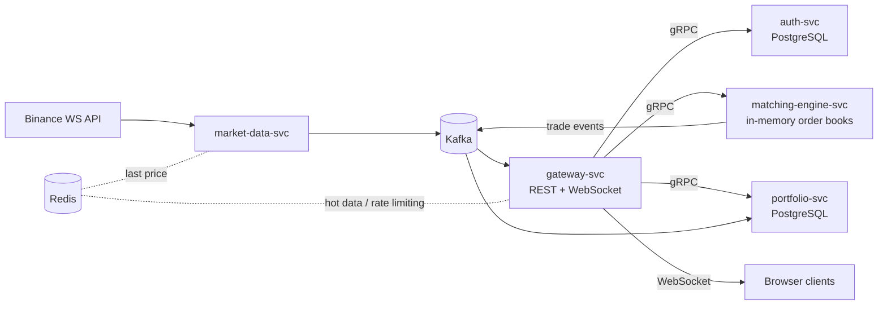

# parkett

> A real-time paper-trading platform written in Go — named after the trading floor
> ("Börsenparkett") of the Frankfurt Stock Exchange.

Live market data flows from Binance over Kafka into an in-memory matching engine;
trades and order-book updates are fanned out to browsers over WebSockets.
Built as an event-driven system of five Go services communicating via gRPC and Kafka.

## Status

🚧 **Work in progress** — currently building: **Phase 1 — Matching Engine core**.

This project is being built in public. The roadmap below tracks real progress;
benchmarks and a live demo link will be added as soon as they exist — not before.

## Architecture



## Services

| Service | Responsibility | Storage | Talks via |
|---|---|---|---|
| `market-data-svc` | Consume Binance WebSocket, normalize ticks, publish to Kafka | Redis (last price) | Kafka producer |
| `matching-engine-svc` | Order book per symbol, price-time-priority matching, trade events | in-memory | gRPC server, Kafka producer |
| `portfolio-svc` | Accounts, cash balance, positions, order history | PostgreSQL | gRPC server, Kafka consumer |
| `auth-svc` | Registration, login, JWT issuing/validation | PostgreSQL | gRPC server |
| `gateway-svc` | REST API, WebSocket fan-out, JWT middleware, rate limiting | Redis | gRPC clients, Kafka consumer |

## Design principles

- **Single writer per order book** (LMAX-style): one goroutine owns each symbol's book, orders arrive over channels — no locks on the hot path.
- **At-least-once + idempotent consumers**: trade events carry unique IDs; consumers deduplicate.
- **Honest benchmarks**: every performance claim in this README is backed by a reproducible `go test -bench` run or k6 script in this repo.

## Roadmap

- [x] Phase 0 — Project scaffold, CI, local infra (Docker Compose)
- [ ] Phase 1 — Matching engine core + benchmarks
- [ ] Phase 2 — Market data pipeline (Binance → Kafka)
- [ ] Phase 3 — Services + gRPC (auth, portfolio, matching)
- [ ] Phase 4 — Gateway, WebSocket fan-out, minimal frontend
- [ ] Phase 5 — Observability (Prometheus, Grafana, OpenTelemetry)
- [ ] Phase 6 — Deployment (k3s, live demo)
- [ ] Phase 7 — Polish (benchmark report, demo video)

## Tech stack

Go · gRPC (buf) · Kafka (franz-go) · PostgreSQL (pgx + sqlc) · Redis · WebSockets ·
Prometheus · Grafana · OpenTelemetry · Docker · Kubernetes (k3s)

## Local development

```bash
docker compose up -d   # Kafka (Redpanda), PostgreSQL, Redis
make test              # run all tests (race detector on)
make lint              # golangci-lint
```

## License

[MIT](LICENSE)
